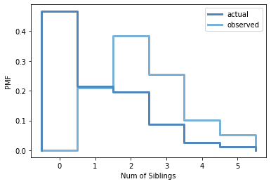

[Think Stats Chapter 3 Exercise 1](http://greenteapress.com/thinkstats2/html/thinkstats2004.html#toc31) (actual vs. biased)

```
#I'll start by making a dict

num_kids = {}

for x in resp['numkdhh']:  
    if x in num_kids.keys():  
        num_kids[x] += 1  
    else:  
        num_kids[x] = 1  
        
num_kids  
```

>**{3: 666, 0: 3563, 2: 1500, 1: 1636, 4: 196, 5: 82}** 


```
#now I'll make my pmfs

num_kids_pmf = thinkstats2.Pmf(num_kids, label='actual')  
num_kids_biased_pmf = BiasPmf(num_kids_pmf, label='observed')  
```

```
#plotting

thinkplot.PrePlot(2)  
thinkplot.Pmfs([num_kids_pmf, num_kids_biased_pmf])  
thinkplot.Config(xlabel='Num of Siblings', ylabel='PMF')  
```



```
print('Actual mean', num_kids_pmf.Mean())  
print('Observed mean', num_kids_biased_pmf.Mean())  
```

> **Actual mean 1.024205155043831  
Observed mean 2.403679100664282**