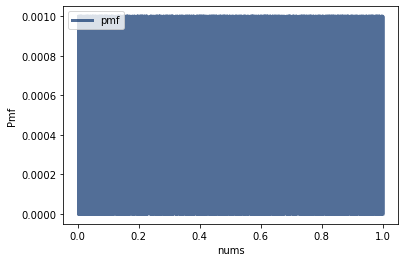
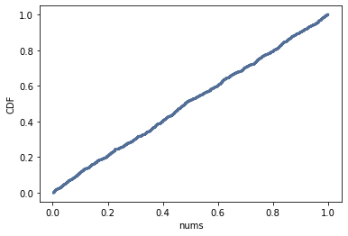

[Think Stats Chapter 4 Exercise 2](http://greenteapress.com/thinkstats2/html/thinkstats2005.html#toc41) (a random distribution)

```
rand_nums = [x for x in np.random.random(1000)]

pmf = thinkstats2.Pmf(rand_nums, label='pmf')  
thinkplot.Pmf(pmf)  
thinkplot.Config(xlabel='nums', ylabel='Pmf')  

```



>We can't tell what kind of distribution this is, there are way too many values.


```
nums_cdf = thinkstats2.Cdf(rand_nums)
thinkplot.Cdf(nums_cdf)
thinkplot.Config(xlabel='nums', ylabel='CDF')
```



> The distribution here is uniform.
