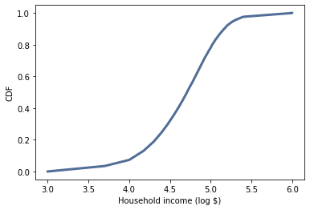
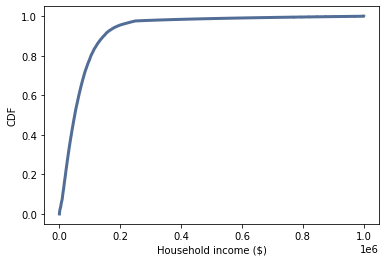
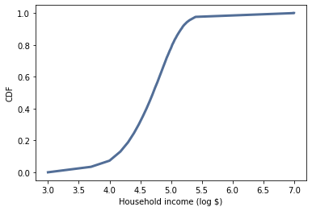
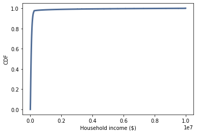

[Think Stats Chapter 6 Exercise 1](http://greenteapress.com/thinkstats2/html/thinkstats2007.html#toc60) (household income)


Compute the median, mean, skewness and Pearson’s skewness of the resulting sample. What fraction of households report a taxable income below the mean? How do the results depend on the assumed upper bound?


```
#sample with upper bound being 10^6 (one million)

log_sample = InterpolateSample(income_df, log_upper=6.0)

log_cdf = thinkstats2.Cdf(log_sample)  
thinkplot.Cdf(log_cdf)  
thinkplot.Config(xlabel='Household income (log $)',   
               ylabel='CDF') 

```




```
sample = np.power(10, log_sample)

cdf = thinkstats2.Cdf(sample)  
thinkplot.Cdf(cdf)  
thinkplot.Config(xlabel='Household income ($)',   
               ylabel='CDF')  
```





```
print('median = ', Median(sample))  
print('mean = ', Mean(sample))  
print('skewness = ', Skewness(sample))  
print('Pearson\'s skewnes = ', PearsonMedianSkewness(sample))
```
median =  51226.45447894046  
mean =  74278.70753118733  
skewness =  4.949920244429583  
Pearson's skewnes =  0.7361258019141782  


```
#probability of being below the mean
cdf.Prob((74278.70753118733))
```

0.660005879566872

Approximately 66% of households fall below the mean.


```
#let's see when we raise the upper limit to 10^7 (10 million)
  
ten_mill_log_sample = InterpolateSample(income_df, log_upper=7.0)


ten_mill_log_cdf = thinkstats2.Cdf(ten_mill_log_sample)  
thinkplot.Cdf(ten_mill_log_cdf)  
thinkplot.Config(xlabel='Household income (log $)',   
               ylabel='CDF')
```





```
ten_mill_sample = np.power(10, ten_mill_log_sample)

ten_mill_cdf = thinkstats2.Cdf(ten_mill_sample)
thinkplot.Cdf(ten_mill_cdf)  
thinkplot.Config(xlabel='Household income ($)',   
               ylabel='CDF')
```





```
print('median = ', Median(ten_mill_sample))  
print('mean = ', Mean(ten_mill_sample))  
print('skewness = ', Skewness(ten_mill_sample))  
print('Pearson\'s skewnes = ',  PearsonMedianSkewness(ten_mill_sample))
```

median =  51226.45447894046  
mean =  124267.39722164685  
skewness =  11.603690267537793  
Pearson's skewnes =  0.39156450927742087  

```
#probability of being below the mean  
ten_mill_cdf.Prob(124267.39722164685)
```
0.8565630665207663


We can see that it is much more skewed when we raise the upper bound and that far more households, ~86%, fall below the mean in this case.

