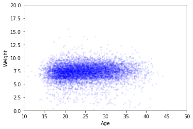
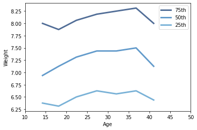

[Think Stats Chapter 7 Exercise 1](http://greenteapress.com/thinkstats2/html/thinkstats2008.html#toc70) (weight vs. age)

Using data from the NSFG, make a scatter plot of birth weight versus mother’s age. Plot percentiles of birth weight versus mother’s age. Compute Pearson’s and Spearman’s correlations. How would you characterize the relationship between these variables?


```
import first

live, firsts, others = first.MakeFrames()  
live = live.dropna(subset=['agepreg',  'totalwgt_lb'])


ages = live.agepreg  
weights = live.totalwgt_lb) 

#start by checking the range

print('min age', min(ages))  
print('max age', max(ages))  
print('min weight', min(weights))  
print('max weight', max(weights))  
```
min age 10.83  
max age 44.08   
min weight 0.125  
max weight 15.4375  


```
#plot the scatter plot  

thinkplot.Scatter(ages, weights, alpha=0.1, s=10)  
thinkplot.Config(xlabel='Age',   
                 ylabel='Weight',  
                 axis=[10, 50, 0, 20],  
                 legend=False) 
```





```
#plot the percentiles

bins = np.arange(10, 50, 5).  
indices = np.digitize(live.agepreg, bins).  
groups = live.groupby(indices)  

mean_age = [group.agepreg.mean() for i, group in groups]  
cdfs = [thinkstats2.Cdf(group.totalwgt_lb) for i, group in groups]  

for percent in [75, 50, 25]:   
    weight_percentiles = [cdf.Percentile(percent) for cdf in cdfs]  
    label = '%dth' % percent  
    thinkplot.Plot(mean_age, weight_percentiles, label=label)  
    
thinkplot.Config(xlabel='Age',   
                 ylabel='Weight',   
                 xlim=[10, 50],   
                 legend=True)  
``` 




```
print('Pearson\'s correlation =', Corr(ages, weights))  
print('Spearman\'s correlation =', SpearmanCorr(ages, weights))
```

Pearson's correlation = 0.0688339703541091  
Spearman's correlation = 0.09461004109658226

